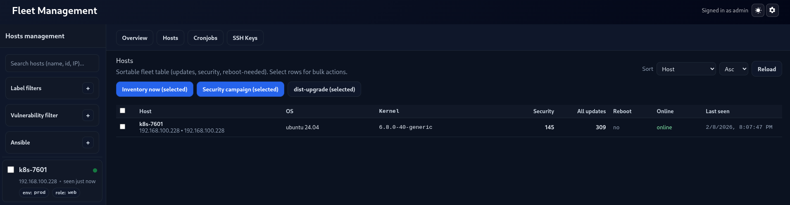

# Ubuntu Central Management

A working MVP for centralized Ubuntu host management:

- **FastAPI server** (PostgreSQL-backed) with a simple web UI
- **Go agent** that inventories hosts and executes jobs via REST long-poll
- Package inventory + upgrade flows, service control, user lock/unlock, SSH key deploy approvals

This is intentionally pragmatic: REST + JSON, no gRPC/protoc requirement.

---

## What you get

### Web UI
- Fleet overview + “Attention required” (offline, high disk, high load, security updates, etc.)
- Per-host:
  - metrics (CPU/mem/disk), top processes
  - packages list + package details (homepage link opens in new tab)
  - system services (click a service → details)
  - system users (click a user → details)
  - SSH keys: add keys and request deployments with admin approval

### API
- `/health` for health checks
- `/hosts/*` for host metrics, packages, users, services
- `/jobs/*` to dispatch/inspect jobs

---

## Quick start (server)

### 1) Prereqs
- Docker + Docker Compose
- If needed: sudo apt install docker.io docker-compose-v2 ansible-core -y
- If needed: sudo usermod $USER -a -G docker # log out and log in again.

### 2) Clone the code and configure secrets
```bash
git clone https://github.com/impsik/linux-central-management.git
cd linux-central-management

# Configure server env
cd deploy/docker
cp env.example .env
# edit .env and set at least:
#   BOOTSTRAP_PASSWORD
#   AGENT_SHARED_TOKEN
# optionally:
#   AGENT_TERMINAL_TOKEN (only if you enable terminal)
```

### 3) Start
```bash
docker compose up -d --build
curl -s http://localhost:8000/health
```

Open UI:
- http://<IP_ADDRESS>:8000/

Login with the bootstrap user you set in `deploy/docker/.env`.

---

## Agent setup (for each Ubuntu host)

### 1) Build (or copy the binary)
```bash
cd ../../agent
sudo apt  install golang-go
go build -o fleet-agent ./cmd/fleet-agent
ssh-copy-id $USER@<to agent IP address/FQDN>
scp fleet-agent IP ADDRESS:/home/USERNAME/fleet-agent
```
### For quick testing
```bash
cd ../
cp hosts.example hosts
# edit hosts
SERVER_URL=http://<SERVER_IP>:8000 AGENT_TOKEN=<AGENT_SHARED_TOKEN> TERM_TOKEN=<AGENT_TERMINAL_TOKEN> TARGETS=all ./script.sh
```

### 2) Run (foreground)
```bash
export FLEET_SERVER_URL=http://<SERVER_IP>:8000
export FLEET_AGENT_ID=<unique-id>        # can be host IP or stable name
export FLEET_LABELS=env=prod,role=web    # Add env and role as you see fit
export FLEET_AGENT_TOKEN=<AGENT_SHARED_TOKEN>
export FLEET_TERMINAL_TOKEN=<AGENT_TERMINAL_TOKEN>

./fleet-agent
```

### 3) Run as a service (recommended)
Create a systemd unit (example):

```ini
# /etc/systemd/system/fleet-agent.service
[Unit]
Description=Fleet Agent
After=network-online.target
Wants=network-online.target

[Service]
Type=simple
ExecStart=/opt/fleet-agent/fleet-agent
Environment=FLEET_SERVER_URL=http://<SERVER_IP>:8000
Environment=FLEET_AGENT_ID=<unique-id>
Environment=FLEET_LABELS=env=prod,role=web
Environment=FLEET_AGENT_TOKEN=<AGENT_SHARED_TOKEN>
Restart=always
RestartSec=2

[Install]
WantedBy=multi-user.target
```

Then:
```bash
sudo systemctl daemon-reload
sudo systemctl enable --now fleet-agent
sudo systemctl status fleet-agent
```

---

## Security notes

### Bootstrap UI password
The server **does not** ship with a safe default password. You must set:
- `BOOTSTRAP_PASSWORD` in `deploy/docker/.env`

### Agent authentication
All agent endpoints require a shared token (required by default):
- Server: `AGENT_SHARED_TOKEN`
- Agent: `FLEET_AGENT_TOKEN`

For local development only, you can bypass this requirement by setting:
- `ALLOW_INSECURE_NO_AGENT_TOKEN=true`

Do **not** use that on anything exposed beyond a trusted LAN.

### Terminal feature (high risk)
The agent has an optional websocket PTY feature.
Enable only on trusted networks and only with explicit tokens.

### HTTP security headers
The server sets basic security headers by default (e.g. `X-Frame-Options`, `X-Content-Type-Options`).
For internet exposure, run behind HTTPS and set:
- `UI_COOKIE_SECURE=true`

Optional (advanced): you can set a custom `CONTENT_SECURITY_POLICY` env var, but the built-in UI uses inline scripts,
so a strict CSP may require additional work.

Token wiring (must match):
- **Server** env: `AGENT_TERMINAL_TOKEN`
- **Agent** env: `FLEET_TERMINAL_TOKEN` (agent also accepts legacy `TERM_TOKEN` / `AGENT_TERMINAL_TOKEN`)

---

## Background metrics refresh
The server maintains a cached `host_metrics_snapshots` table for fast attention checks.
A background refresher keeps it updated.

Config via env (server):
- `METRICS_BACKGROUND_REFRESH_SECONDS` (default 60, set 0 to disable)
- `METRICS_BACKGROUND_BATCH_LIMIT` (default 50)

---

## Developer workflow

### script.sh (developer convenience)
`./script.sh` is a convenience script that:
- rebuilds/restarts Docker Compose server
- builds the agent
- deploys the agent to hosts via Ansible (from `./hosts`)
- restarts the agent service

To use it:
```bash
cp hosts.example hosts
# edit hosts
SERVER_URL=http://<SERVER_IP>:8000 AGENT_TOKEN=<AGENT_SHARED_TOKEN> TERM_TOKEN=<AGENT_TERMINAL_TOKEN> TARGETS=all ./script.sh
```

---
