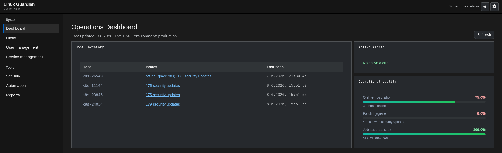

# Linux Central Management

Simple central management for Linux servers.

It runs one admin web node and a small agent on each managed host. From the web
UI you can see host health, packages, services, users, SSH keys, jobs, saved
views, audit logs, and other day-to-day operations.



## Requirements

- Ubuntu/Debian/RedHat server for the admin node
- SSH access from the admin node to managed hosts
- `sudo` access on managed hosts for agent installation

The installer installs the needed admin-node packages, including Docker,
Compose, Git, Python, OpenSSL, Ansible, and Go.

## Install Admin Node

RedHat: install manually needed packages

```bash
sudo dnf install -y git curl ca-certificates python3 openssl ansible-core golang docker-ce docker-ce-cli containerd.io docker-buildx-plugin docker-compose-plugin
```

Run this on the Ubuntu/Debian/RedHat server that will host the web UI (RedHat based will be added, maybe):

```bash
curl -fsSL https://raw.githubusercontent.com/impsik/linux-central-management/main/install.sh | sh
```

The installer prompts for:

- web/server URL
- bootstrap admin username and password
- optional managed hosts to add immediately
- SSH username for those hosts
- Managed hosts to deploy agent to

It creates secure tokens, writes `.env` files, starts Docker Compose, and can
deploy the agent to the first hosts.

After install, open:

```text
http://<admin-node-ip>:8000/
```

Use the bootstrap admin username and password shown by the installer.

## Add More Hosts Later

On the admin node:

```bash
cd ~/linux-central-management
./add-host.sh
```

The helper reuses the existing server URL and tokens, updates `hosts` and
`ansible/inventory.yml`, then deploys the agent only to the new host(s).

## Rerun Or Update

It is safe to rerun the installer:

```bash
curl -fsSL https://raw.githubusercontent.com/impsik/linux-central-management/main/install.sh | sh
```

Existing passwords, agent tokens, terminal tokens, and MFA encryption keys are
preserved unless you explicitly choose to rotate them.

## Important Files

- `deploy/docker/.env` - server settings and secrets
- `.env` - helper/agent deployment values
- `hosts` - Ansible host list used by deploy scripts
- `ansible/inventory.yml` - inventory used by the web app and Ansible helpers
- `install.sh` - admin-node installer
- `add-host.sh` - attach more managed hosts later

Keep `.env` files private.

## Security Notes

- Use HTTPS if exposing the UI outside a trusted LAN.
- Keep `AGENT_SHARED_TOKEN`, `AGENT_TERMINAL_TOKEN`, and
  `MFA_ENCRYPTION_KEY` secret.
- MFA is enabled for privileged users by default.
- The browser terminal feature is powerful; enable it only where needed.

