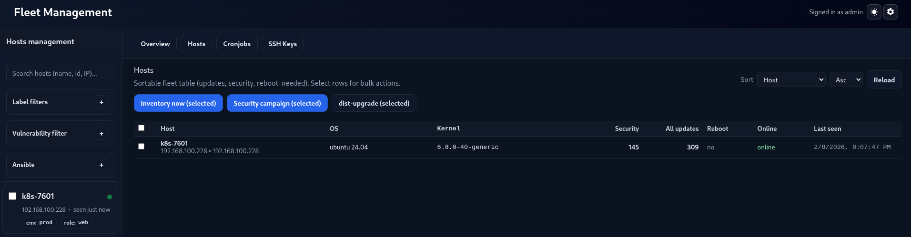

# Ubuntu Central Management

A working MVP for centralized Ubuntu host management:

- **FastAPI server** (PostgreSQL-backed) with a simple web UI
- **Go agent** that inventories hosts and executes jobs via REST long-poll
- Package inventory + upgrade flows, service control, user lock/unlock, SSH key deploy approvals

This is intentionally pragmatic: REST + JSON, no gRPC/protoc requirement.

---

## What you get

### Web UI
- Fleet overview + “Attention required” (offline, high disk, high load, security updates, etc.)
- **Morning Brief** card with quick drill-down actions
- **Notification Center** (unread badge, mark-read, snooze by alert kind)
- **Backup verification** status card (verified/stale/failed), latest timestamp, details link, configurable stale threshold
- **Failed run details** modal copy helper with robust clipboard fallback (clipboard API → legacy copy → manual Ctrl/Cmd+C)
- **Saved Views** for host filters (per-user, shared/team views, default startup view)
- **Create cron from current view** + run-now/runbook quick actions
- Per-host:
  - metrics (CPU/mem/disk), top processes
  - packages list + package details (homepage link opens in new tab)
  - system services (click a service → details)
  - system users (click a user → details)
  - SSH keys: add keys and request deployments with admin approval
- Admin:
  - users list + create/reset/deactivate users
  - audit log (who did what: auth, user lifecycle, MFA, package actions, etc.)
- Patching rollout controls:
  - campaign rollout summary (per-wave)
  - pause/resume rollout
  - approve-next wave for progressive rollout

### API
- `/health` for health checks
- `/hosts/*` for host metrics, packages, users, services
- `/jobs/*` to dispatch/inspect jobs
- `/dashboard/notifications` for in-app notification feed
- `/auth/views` for saved views (user/shared)
- `/dashboard/alerts/teams/*` for Teams test + morning brief push
- `/backup-verification/*` for verification runs + policy:
  - `POST /backup-verification/runs`
  - `GET /backup-verification/latest`
  - `GET /backup-verification/runs/{id}`
  - `GET /backup-verification/policy`
  - `PUT /backup-verification/policy`
  - `POST /backup-verification/policy/run-now`
- rollout control APIs:
  - `GET /patching/campaigns/{campaign_id}/rollout`
  - `POST /patching/campaigns/{campaign_id}/pause`
  - `POST /patching/campaigns/{campaign_id}/resume`
  - `POST /patching/campaigns/{campaign_id}/approve-next`

---

## Quick start (server)

### 1) Prereqs
- Docker + Docker Compose
- If needed:
```bash
sudo apt install docker.io docker-compose-v2 ansible-core golang-go -y
sudo usermod $USER -a -G docker # log out and log in again.
```

### 2) Clone the code and configure secrets
```bash
git clone https://github.com/impsik/linux-central-management.git
cd linux-central-management

# Configure server env
cd deploy/docker
cp env.example .env
# edit .env and set at least:
#   BOOTSTRAP_PASSWORD
#   AGENT_SHARED_TOKEN
#   MFA_ENCRYPTION_KEY   (required when MFA is enabled; see below)
# optionally:
#   AGENT_TERMINAL_TOKEN (only if you enable terminal)
#   TEAMS_WEBHOOK_URL + TEAMS_ALERTS_ENABLED=true (if you want Teams alerts)
```

### 3) Start
```bash
docker compose up -d --build

# Apply DB migrations (recommended for any deployment with existing DB volume)
docker compose exec server alembic upgrade head

curl -s http://localhost:8000/health
```

Open UI:
- http://localhost:8000/ (local dev only)

For non-local deployments, run behind HTTPS reverse proxy (Caddy example):
```bash
cd deploy/docker
cp caddy-compose.example.yml caddy-compose.yml
# Domain mode (public DNS): set FLEET_DOMAIN + CADDY_EMAIL
# OR IP/LAN mode (no domain): set FLEET_SITE=https://<server-ip>
# Shared: FLEET_UPSTREAM=server:8000
# and keep UI_COOKIE_SECURE=true

docker compose -f docker-compose.yml -f caddy-compose.yml up -d --build
```
Then open:
- https://<your-domain>/  (domain mode)
- https://<server-ip>/    (IP/LAN mode; accept/trust local cert)

Login with the bootstrap user you set in `deploy/docker/.env`.

---

## Agent setup (for each Ubuntu host)

### 1) Build (or copy the binary)
```bash
cd ../../agent
go build -o fleet-agent ./cmd/fleet-agent
ssh-copy-id $USER@<to agent IP address/FQDN>
scp fleet-agent IP ADDRESS:/home/USERNAME/fleet-agent
```
### For quick testing
```bash
cd ../
cp hosts.example hosts
# edit hosts
# script.sh now auto-creates .env files and secure tokens on first run.
# You can still override values explicitly via env vars when needed.
SERVER_URL=http://<SERVER_IP>:8000 TARGETS=all ./script.sh
```

### 2) Run (foreground)
```bash
export FLEET_SERVER_URL=http://<SERVER_IP>:8000
export FLEET_AGENT_ID=<unique-id>        # can be host IP or stable name
export FLEET_LABELS=env=prod,role=web    # Add env and role as you see fit
export FLEET_AGENT_TOKEN=<AGENT_SHARED_TOKEN>
export FLEET_TERMINAL_TOKEN=<AGENT_TERMINAL_TOKEN>

./fleet-agent
```

### 3) Run as a service (recommended)
Create a systemd unit (example):

```ini
# /etc/systemd/system/fleet-agent.service
[Unit]
Description=Fleet Agent
After=network-online.target
Wants=network-online.target

[Service]
Type=simple
ExecStart=/opt/fleet-agent/fleet-agent
Environment=FLEET_SERVER_URL=http://<SERVER_IP>:8000
Environment=FLEET_AGENT_ID=<unique-id>
Environment=FLEET_LABELS=env=prod,role=web
Environment=FLEET_AGENT_TOKEN=<AGENT_SHARED_TOKEN>
Restart=always
RestartSec=2

[Install]
WantedBy=multi-user.target
```

Then:
```bash
sudo systemctl daemon-reload
sudo systemctl enable --now fleet-agent
sudo systemctl status fleet-agent
```

---

## Security notes

See also: `docs/security-baseline.md`.

### Bootstrap UI password
The server **does not** ship with a safe default password. You must set:
- `BOOTSTRAP_PASSWORD` in `deploy/docker/.env`

### OIDC SSO (foundation / in progress)
OIDC configuration flags are now available (feature-flagged, disabled by default):
- `AUTH_OIDC_ENABLED=true|false`
- `AUTH_OIDC_ISSUER`
- `AUTH_OIDC_CLIENT_ID`
- `AUTH_OIDC_CLIENT_SECRET`
- `AUTH_OIDC_REDIRECT_URI`
- `AUTH_OIDC_SCOPES` (default `openid profile email`)
- `AUTH_OIDC_ALLOWED_EMAIL_DOMAINS` (optional)
- `AUTH_OIDC_GROUP_ROLE_MAP` (optional JSON map, e.g. `{"fleet-admins":"admin","fleet-ops":"operator"}`)
- `AUTH_OIDC_GROUP_SCOPE_MAP` (optional JSON map for scope selectors, e.g. `{"fleet-prod":[{"env":["prod"]}]}`)

Current status:
- Login page can show **Sign in with SSO** when OIDC is enabled.
- `/auth/oidc/login` performs OIDC discovery + redirects to IdP.
- `/auth/oidc/callback` now exchanges code, validates `id_token` (issuer/audience/signature/nonce), fetches userinfo, provisions/links user, and creates app session.
- OIDC group->role mapping is supported via `AUTH_OIDC_GROUP_ROLE_MAP`; unmapped users default to `readonly`.
- OIDC group->scope sync is supported via `AUTH_OIDC_GROUP_SCOPE_MAP`; label selectors are synced on each OIDC login.
- Admin diagnostic endpoint for mapping checks: `POST /auth/admin/oidc/map-preview`.
- Admin UI includes an **OIDC mapping preview** card for quick claim-to-role/scope checks.

### MFA (TOTP) for privileged users
By default, MFA is **required** for `admin` and `operator` users.
Readonly users can be password-only.

Set an encryption key (Fernet) in `deploy/docker/.env`:
- `MFA_ENCRYPTION_KEY`

Generate one:
```bash
python3 -c "from cryptography.fernet import Fernet; print(Fernet.generate_key().decode())"
```

When you log in as a privileged user, the UI will force MFA enrollment and show recovery codes.

You can control MFA behavior via env (server):
- `MFA_REQUIRE_FOR_PRIVILEGED=true|false`
- `MFA_TOTP_ISSUER` (default: `linux-central-management`)

### Agent authentication
All agent endpoints require a shared token (required by default):
- Server: `AGENT_SHARED_TOKEN`
- Agent: `FLEET_AGENT_TOKEN`

For local development only, you can bypass this requirement by setting:
- `ALLOW_INSECURE_NO_AGENT_TOKEN=true`

Do **not** use that on anything exposed beyond a trusted LAN.

### Token/env checklist (what to set, where)
No new secret tokens were introduced for backup verification or rollout controls.
Use the existing env/token wiring below:

### Startup guardrails (non-local deployments)
The server now fails fast on non-local deployments if insecure settings are detected.

Blocked conditions:
- placeholder or missing `BOOTSTRAP_PASSWORD`
- placeholder or missing `AGENT_SHARED_TOKEN`
- missing/placeholder `MFA_ENCRYPTION_KEY` when MFA is required
- `UI_COOKIE_SECURE=false`
- `DB_AUTO_CREATE_TABLES=true`
- terminal enabled with `AGENT_TERMINAL_SCHEME=ws` (requires `wss`)

Local dev remains supported with `ALLOW_INSECURE_NO_AGENT_TOKEN=true` and local DB settings.

**Server (`deploy/docker/.env`)**
- `BOOTSTRAP_PASSWORD` (required)
- `AGENT_SHARED_TOKEN` (required)
- `MFA_ENCRYPTION_KEY` (required when MFA is enabled)
- `AGENT_TERMINAL_TOKEN` (only if terminal feature is enabled)
- `TEAMS_WEBHOOK_URL` + `TEAMS_ALERTS_ENABLED=true` (optional Teams alerts)

**Agent host (systemd/ENV)**
- `FLEET_AGENT_TOKEN` = same value as server `AGENT_SHARED_TOKEN`
- `FLEET_TERMINAL_TOKEN` = same value as server `AGENT_TERMINAL_TOKEN` (if terminal enabled)

If token values do not match between server and agent, registration/job polling/terminal proxy calls will fail.

### Terminal feature (high risk)
The agent has an optional websocket PTY feature.
Enable only on trusted networks and only with explicit tokens.

### HTTP security headers
The server sets basic security headers by default (e.g. `X-Frame-Options`, `X-Content-Type-Options`).
For internet exposure, run behind HTTPS and set:
- `UI_COOKIE_SECURE=true`

Cookie transport guardrail:
- `UI_COOKIE_SECURE=true` + HTTP access => browser rejects session cookie (appears as login loop)
- HTTP/IP mode should use `UI_COOKIE_SECURE=false`
- HTTPS mode should use `UI_COOKIE_SECURE=true`

Optional (advanced): set `CONTENT_SECURITY_POLICY` env var to override the default nonce-based CSP.
By default the server emits a restrictive CSP with per-request script nonces and no `unsafe-inline` for scripts.

Token wiring (must match):
- **Server** env: `AGENT_TERMINAL_TOKEN`
- **Agent** env: `FLEET_TERMINAL_TOKEN` (agent also accepts legacy `TERM_TOKEN` / `AGENT_TERMINAL_TOKEN`)

For HTTPS deployments, also set:
- `AGENT_TERMINAL_SCHEME=wss`

Caddy reverse-proxy modes (`deploy/docker/caddy-compose.example.yml` + `Caddyfile.example`):
- Domain/TLS: `FLEET_SITE_ADDR=fleet.example.com`
- IP/no-domain HTTP: `FLEET_SITE_ADDR=:80` (or `192.168.x.x:80`)
- Upstream usually: `FLEET_UPSTREAM=server:8000`

### Docker deployment defaults
- Postgres is internal-only by default in `deploy/docker/docker-compose.yml` (not published to host).
- If you need host-local debug access, expose `127.0.0.1:5432:5432` via compose override.

### CI security gate (required check)
A dedicated GitHub Actions workflow is provided at:
- `.github/workflows/security.yml`

It runs a `Security` check (secrets, SAST, dependency vulns, and Trivy scans).
For protected branches, configure branch protection to require the **Security** status check before merge.
See also: `RELEASE_SECURITY_CHECKLIST.md`.

### Maintenance window guardrails (optional)
Use this to block risky actions outside an approved window.

Env settings:
- `MAINTENANCE_WINDOW_ENABLED=true|false`
- `MAINTENANCE_WINDOW_TIMEZONE` (IANA TZ, e.g. `UTC`, `Europe/Tallinn`)
- `MAINTENANCE_WINDOW_START_HHMM` (e.g. `01:00`)
- `MAINTENANCE_WINDOW_END_HHMM` (e.g. `05:00`)
- `MAINTENANCE_WINDOW_GUARDED_ACTIONS` (CSV, default `dist-upgrade,security-campaign`)

When enabled, guarded actions are rejected with HTTP 403 outside the configured window.

### Notification dedupe/cooldown (optional)
Reduce repeated alert noise in Notification Center using server-side cooldowns.

Env settings:
- `NOTIFICATIONS_DEDUPE_ENABLED=true|false`
- `NOTIFICATIONS_DEDUPE_COOLDOWN_SECONDS` (default `1800`)

When enabled, repeated alerts for the same key (e.g., same offline host) are suppressed during cooldown.

### Two-person approvals for high-risk actions (optional)
Require explicit admin approval before execution of selected high-risk actions.

Env settings:
- `HIGH_RISK_APPROVAL_ENABLED=true|false`
- `HIGH_RISK_APPROVAL_ACTIONS` (CSV, default `dist-upgrade,security-campaign`)

When enabled, risky actions return `approval_required=true` and create pending approval requests.
Requester cannot approve/reject own request (enforced two-person rule).
All approval lifecycle steps are written to the audit log.
Admin endpoints:
- `GET /approvals/admin/pending`
- `POST /approvals/admin/{request_id}/approve`
- `POST /approvals/admin/{request_id}/reject`
User endpoint:
- `GET /approvals/my`

---

## Background metrics refresh
The server maintains a cached `host_metrics_snapshots` table for fast attention checks.
A background refresher keeps it updated.

Config via env (server):
- `METRICS_BACKGROUND_REFRESH_SECONDS` (default 60, set 0 to disable)
- `METRICS_BACKGROUND_BATCH_LIMIT` (default 50)

---

## Teams alerts (optional)
You can send alerts to a Microsoft Teams channel via Incoming Webhook.

### Env settings
In `deploy/docker/.env`:
- `TEAMS_WEBHOOK_URL=<incoming webhook url>`
- `TEAMS_ALERTS_ENABLED=true`

### Create webhook in Teams
1. Open target Team + Channel
2. Add **Incoming Webhook** (or Workflow HTTP endpoint, depending on tenant policy)
3. Copy URL and set `TEAMS_WEBHOOK_URL`

### Test from UI
In Fleet Overview → **Data freshness**:
- `Teams: Send test`
- `Teams: Send morning brief`

If your tenant blocks webhook creation, use in-app Notification Center until Teams admin enables it.

---

## Developer workflow

### script.sh (developer convenience)
`./script.sh` is a convenience script that:
- rebuilds/restarts Docker Compose server
- builds the agent
- deploys the agent to hosts via Ansible (from `./hosts`)
- restarts the agent service
- validates cookie-mode guardrail (`SERVER_URL` vs `UI_COOKIE_SECURE`) to prevent HTTP login loops

To use it:
```bash
cp hosts.example hosts
# edit hosts
SERVER_URL=http://<SERVER_IP>:8000 AGENT_TOKEN=<AGENT_SHARED_TOKEN> TERM_TOKEN=<AGENT_TERMINAL_TOKEN> TARGETS=all ./script.sh
```

### CI
GitHub Actions runs:
- frontend unit tests
- backend smoke tests (overview/notifications/cron)
- full backend test suite

Workflow file: `.github/workflows/ci.yml`

### Theme audit
Run the lightweight theme hardening guard before committing UI template changes:

```bash
python3 scripts/theme-audit.py
```

The script exits non-zero when it finds risky hardcoded hex colors in server templates/reports.

### Release notes
See `CHANGELOG.md` for recent feature additions/fixes.

---
