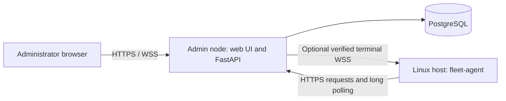

# Linux Central Management — Self-Hosted Linux Server and Patch Management

Linux Central Management is a self-hosted Linux server and patch management
platform for system administrators managing multiple machines. Monitor your
Linux fleet, review available security updates and CVE reports, manage services
and SSH access, and run Ansible automation from one web dashboard.

Keep the web application, PostgreSQL database and management data on your own
infrastructure. A Go `fleet-agent` service runs on each managed host.
The web interface currently displays the name **Linux Guardian**; it is the UI
of this project.

**Status: 0.1.0 beta.** Start with a pilot fleet and validate the operations you
need on your distributions before broader deployment. See the
[changelog](CHANGELOG.md) and [distribution support](#linux-distribution-support).

[Get started](#quick-start) · [Explore features](#linux-fleet-management-features) ·
[Installation guide](docs/installation.md) ·
[Report an issue](https://github.com/impsik/linux-central-management/issues)


*Operations dashboard: see host availability, pending security updates and job
success in one view. Screenshot uses the Linux Guardian UI name; appearance may
vary by version.*

## Why use Linux Central Management?

- **Know which servers need attention.** Find hosts by owner, label, operating
  system or health, then inspect inventory and available updates.
- **Plan Linux patching centrally.** Review security updates and organize
  campaigns with maintenance windows, rollout controls and high-risk approvals.
- **Handle routine administration in one place.** Manage systemd services,
  users, SSH keys and firewall rules without switching between host sessions.
- **Track automated work.** Run Ansible actions and scheduled jobs, inspect
  execution logs and review audit history.

## Quick start

Use a Linux admin node with systemd, root or sudo access, and a hostname that
both your browser and managed hosts can resolve. The application uses Docker
Compose and PostgreSQL. APT-based systems can install prerequisites through the
installer; **Red Hat-family admin nodes require
[manual preparation](docs/installation.md#red-hat--rocky-linux--almalinux)**.
Review [requirements and sizing](docs/installation.md#requirements) first.

### 1. Install the admin node

Review [the installer](install.sh), then run it on the machine that will host
the web application:

```bash
curl -fsSL https://raw.githubusercontent.com/impsik/linux-central-management/main/install.sh | sh
```

The installer checks prerequisites, asks for the hostname and setup choices,
configures TLS, applies database migrations and starts the application. You can
leave the first managed-host prompt blank and add hosts from the UI later.
For a preflight-only run, use the
[installation checks](docs/installation.md#run-the-installer).

### 2. Sign in

Open `https://<your-configured-hostname>/` and use the administrator credentials
from installation. Complete the required privileged-account MFA enrollment.
The default TLS setup uses an internal CA: follow the
[browser trust instructions](docs/installation.md#open-the-application).

### 3. Connect a Linux host

In **Connect a Linux host**, select **Create join command**, then run the
one-time command on the managed host with sudo access. Watch the host register
and select **View packages and updates** when inventory arrives.

The command expires after 15 minutes and supports systemd hosts on amd64/x86_64
and arm64/aarch64. SSH-based installation is also available. See
[host onboarding](docs/installation.md#connect-your-first-host) for requirements
and troubleshooting.

## Linux fleet management features

| Workflow | What you can do |
|---|---|
| **Host inventory and health** | Browse OS details, uptime, CPU, memory and disk information; filter hosts with labels, ownership and saved views. |
| **Linux patch management** | Inspect installed packages and updates, plan security campaigns and run controlled full package upgrades. |
| **CVE vulnerability reporting** | Review package and host findings alongside update availability; coverage depends on the distribution and advisory source. |
| **Services and access** | Start, stop and enable systemd services; manage user accounts, SSH keys and sudo access. |
| **Firewall management** | Inspect, add and remove rules, or enable and disable supported firewalls across selected hosts. |
| **Ansible automation** | Execute actions across hosts and schedule one-time or recurring jobs with timezone and maintenance-window controls. |
| **Jobs and reports** | Inspect queue state, retry or cancel jobs, download logs and review operational reports, backup-verification results and audit history. |
| **Authentication and approvals** | Use local accounts, AD/LDAP or OIDC, with role-based access, host visibility scopes, privileged-user MFA and configured two-person approvals. |
| **Browser terminal** | Open terminal sessions through the admin node using TLS/WSS; terminal access is optional and disabled by default. |

## How it works


```mermaid
flowchart LR
    Browser[Administrator browser] -->|HTTPS / WSS| Master[Admin node: web UI and FastAPI]
    Master --> DB[(PostgreSQL)]
    Agent[Linux host: fleet-agent] -->|HTTPS requests and long polling| Master
    Master -->|Optional verified terminal WSS| Agent
```

The admin node runs the Python/FastAPI application and database with Docker
Compose. Managed hosts run the Go agent as a systemd service and do not need
nginx. Browser traffic goes through the admin node.

Agent enrollment can use a one-time command executed on the host or SSH from
the admin node. The installer’s subsequent agent-update workflow uses existing
SSH access, even for hosts originally enrolled with a join command. See
[update requirements](docs/installation.md#update-an-existing-installation).

## Linux Distribution Support

Linux Central Management includes package-management support for Ubuntu/Debian
and Red Hat-family Linux hosts. Installation requirements and security-data
sources differ between these families.

The **admin node** runs the web application and database. **Managed hosts** run
the `fleet-agent` service. Choose the installation instructions for the admin
node's operating system; managed hosts use their own package manager.

| Capability | Ubuntu / Debian family | Red Hat family |
|---|---|---|
| Package inventory | dpkg | RPM |
| Package installation and updates | APT | DNF, with YUM fallback |
| Admin-node prerequisites | Installed automatically by `install.sh` on APT-based systems | Must be installed manually before running `install.sh` |
| CVE data | Central synchronization uses Ubuntu OVAL data for focal, jammy, and noble; this does not provide equivalent Debian coverage | Agent CVE checks include a DNF/YUM `updateinfo` fallback, dependent on repository advisory metadata |
| Full package upgrade | `apt-get dist-upgrade` | `dnf upgrade` or `yum upgrade` |

Full package upgrades use the host's configured repositories. They do not
perform an operating-system release migration, such as Ubuntu 22.04 to 24.04
or RHEL 8 to 9.

Available operations depend on the distribution, configured repositories, and
installed tools.

## Deployment status and security

The shared server and agent release version is recorded in [`VERSION`](VERSION).
The project is in beta; supported package-manager paths are not a guarantee
that every operation has been validated on every distribution version.

The documented short 100-host capacity test met its UI API latency target;
the 250-host test did not pass all acceptance checks. Review the
[measurements and limitations](docs/performance-2026-09-14.md) and
[sizing guidance](docs/installation.md#admin-node-sizing) for your workload.

Use a management network, keep TLS verification enabled and restrict optional
agent terminal access to the admin node. Read the
[security baseline](docs/security-baseline.md) before deployment. Privileged-user
MFA and configured high-risk-action approvals are enabled by default.

## Documentation

| Guide | Use it for |
|---|---|
| [Installation and administration](docs/installation.md) | Prerequisites, HTTPS, first login, enrollment, recovery and unattended setup. |
| [Updating the server and agents](docs/installation.md#update-an-existing-installation) | Update behavior, SSH requirements, retrying failures and retained configuration. |
| [Firewall management](docs/firewall-management.md) | Supported operations and management-access checks. |
| [Security baseline](docs/security-baseline.md) | Authentication, transport security and deployment hardening. |
| [Capacity testing](docs/load-testing.md) | Validate the agent API and fleet workload before scaling. |
| [Development guide](docs/development.md) | Source layout, release versions and backend, frontend and agent test commands. |
| [Frontend testing notes](docs/frontend-testing-notes.md) | Frontend-specific test guidance. |
| [Changelog](CHANGELOG.md) | Release changes and unreleased work. |
| [Release security checklist](RELEASE_SECURITY_CHECKLIST.md) | Checks used when preparing a release. |

## Feedback and contributions

Found a problem or have a workflow to suggest?
[Open a GitHub issue](https://github.com/impsik/linux-central-management/issues)
with your server and agent versions, Linux distribution, reproduction steps and
expected behavior. Remove passwords, tokens, private keys and other sensitive
data from logs and screenshots before sharing them.

For code contributions, use a separate development checkout and follow the
[development guide](docs/development.md). Include the relevant validation results
with your pull request.
