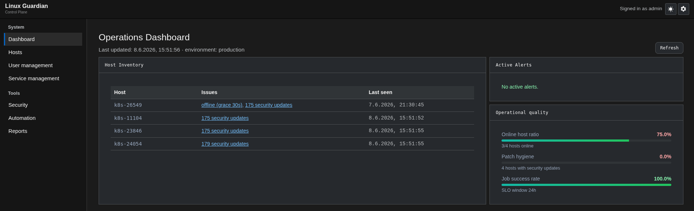
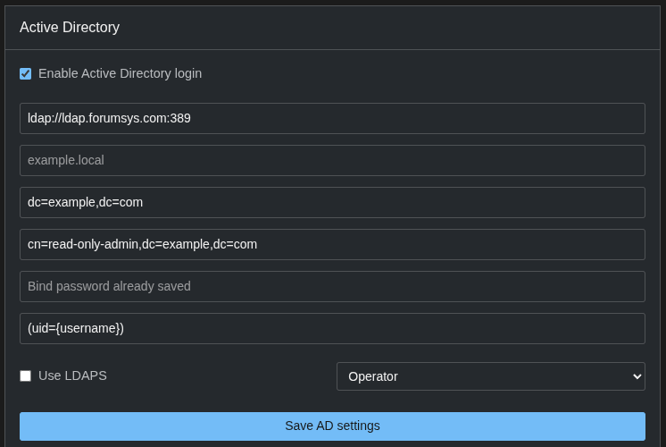

# Linux Central Management

Linux Central Management is a web-based control plane for administering Linux
servers from one place. It runs the web application and PostgreSQL database on
an admin node and installs a small `fleet-agent` service on every managed host.



## Features

### Fleet visibility

- host inventory, ownership, labels, saved views, filtering, and global search;
- online/offline state, operating-system details, uptime, CPU, memory, disk, and
  other host-health information;
- dashboard attention views for operational problems;
- CVE and package-update reporting;
- generated operational reports and backup-verification results.

### Host administration

- package inventory, package updates, security campaigns, and controlled
  distribution upgrades;
- service status and start, stop, restart, enable, and disable operations;
- user-account, SSH-key, and sudo-access management;
- firewall inspection and management;
- browser terminal access to managed hosts;
- Ansible-backed actions across one or more selected hosts.

### Automation and reliability

- one-time and recurring cron jobs with explicit timezone information;
- maintenance-window and high-risk-action controls;
- persistent job queue with queued/running/stale/failed visibility;
- cancellation and requeue controls, retry information, and per-agent queue
  pressure signals;
- job details, stdout/stderr tails, downloadable logs, and failed-run views;
- audit history for administrative and scheduled actions.

### Access and security

- local accounts, Active Directory/LDAP, and OIDC authentication;
- role-based access control and host visibility scopes;
- MFA for privileged users;
- two-person approval for configured high-risk actions;
- per-agent tokens and HMAC-signed agent requests;
- HTTPS for the web UI and native TLS/WSS for browser terminal traffic;
- an internal CA workflow for server and agent terminal certificates.

## Architecture

- **Admin node:** web UI, API, PostgreSQL, Docker Compose, and optionally nginx.
- **Managed host:** `fleet-agent` systemd service. Managed hosts do not require
  nginx; the agent serves its terminal WSS endpoint natively when enabled.
- **Browser:** connects only to the admin node over HTTPS/WSS.
- **Agent:** connects to the admin API over HTTPS. The admin node connects to
  the selected agent's terminal endpoint over verified WSS.

## Requirements

Admin node:

- a supported Ubuntu, Debian, or Red Hat-family Linux server;
- root or `sudo` access;
- outbound access to the Git repository and operating-system package sources;
- Docker Engine with Compose support. The installer installs Docker and other
  required packages where supported;
- a hostname for the application, for example `fleet.example.internal` or
  `fleet.local`, which clients and managed hosts can resolve to the admin node.

Managed hosts:

- SSH access from the admin node;
- root or `sudo` access for the initial agent installation;
- network access to the admin node's HTTPS endpoint;
- network access from the admin node to TCP port `18080` on managed hosts when
  browser terminal access is enabled.

For a larger environment, use internal DNS for the application hostname.
`/etc/hosts` works for testing, but every browser and managed host must resolve
the name consistently. The `.local` suffix may conflict with mDNS on some
networks.

## Install the Admin Node

### Red Hat-family preparation

On Red Hat, Rocky Linux, AlmaLinux, and other `dnf`-based systems, install the
required packages manually before running `install.sh`. The installer installs
OS packages automatically only on `apt`-based systems.

Remove Docker packages that conflict with Docker CE:

```bash
sudo dnf remove -y \
  docker \
  docker-client \
  docker-client-latest \
  docker-common \
  docker-latest \
  docker-latest-logrotate \
  docker-logrotate \
  docker-engine \
  podman \
  runc
```

Install the repository helper and add Docker's official repository:

```bash
sudo dnf install -y dnf-plugins-core

sudo dnf config-manager --add-repo \
  https://download.docker.com/linux/rhel/docker-ce.repo
```

Install the application prerequisites:

```bash
sudo dnf install -y \
  git \
  curl \
  ca-certificates \
  python3 \
  openssl \
  ansible-core \
  golang \
  docker-ce \
  docker-ce-cli \
  containerd.io \
  docker-buildx-plugin \
  docker-compose-plugin

sudo systemctl enable --now docker
sudo usermod -aG docker "$USER"
```

Log out and back in after adding the current user to the `docker` group, or
start a new group-aware shell with `newgrp docker`. Confirm that Docker works
before continuing:

```bash
docker version
docker compose version
```

### Prepare SSH access to managed hosts

The admin node must be able to SSH to every managed host with a user that has
`sudo` rights. Password authentication can be used during attachment, but SSH
keys are recommended.

On the admin node, create a key if needed and copy it to each target host:

```bash
ssh-keygen
ssh-copy-id sudo-user@<IP-or-FQDN>
```

Verify both SSH and sudo access before running the installer:

```bash
ssh sudo-user@<IP-or-FQDN>
sudo -v
```

### Run the installer

Run the installer on the server that will host the web UI:

```bash
curl -fsSL https://raw.githubusercontent.com/impsik/linux-central-management/main/install.sh | sh
```

The installer clones or updates the repository, installs required packages on
supported `apt`-based systems, creates configuration files, prepares TLS
certificates, runs database migrations, and starts the application with Docker
Compose.

### Installer questions

On a new installation, `install.sh` asks for:

1. **Application hostname** — hostname only, without `https://` or a path. The
   default is `fleet.local`.
2. **Fleet server IPv4 address** — the address to which the application
   hostname resolves.
3. **Internal CA certificate path** — defaults to
   `/etc/fleet-pki/fleet-ca.crt`. If the CA does not exist, the installer
   creates it and keeps its private key protected.
4. **Install and configure nginx** — choose `yes` for an installer-managed
   HTTPS reverse proxy or `no` when Apache, Caddy, an existing nginx instance,
   or another proxy will be configured manually.
5. **Bootstrap admin username and password** — leaving a new password blank
   generates a secure password and displays it once in the installation
   summary.
6. **Browser terminal access** — optional and disabled by default. Enabling it
   creates the shared terminal token used by the admin node and agents.
7. **Managed hosts to attach now** — optional, space- or comma-separated.
8. **SSH username** for the managed hosts selected above.
9. **Final confirmation** before building and deploying `fleet-agent` to those
   hosts.

On a rerun, the installer may additionally ask whether to rotate existing:

- bootstrap admin password;
- agent shared token;
- MFA encryption key;
- browser terminal token;
- PostgreSQL password.

Answer `no` unless rotation is intentional. Rotating agent or terminal tokens
requires redeploying affected agents. Rotating the MFA key can invalidate
existing MFA enrollments. PostgreSQL password rotation may require a database
credential migration.

### Reverse proxy choices

If nginx installation is accepted, the installer configures HTTPS and proxies
the application to:

```text
http://127.0.0.1:18000
```

If nginx installation is declined, the installer still creates the internal
CA and application certificate and prints the paths required by your reverse
proxy. The default paths are:

```text
CA certificate:     /etc/fleet-pki/fleet-ca.crt
Server certificate: /etc/fleet-pki/fleet-server.crt
Server private key: /etc/fleet-pki/fleet-server.key
Upstream:           http://127.0.0.1:18000
```

Configure HTTPS in the chosen reverse proxy, then run `./add-host.sh` after the
health endpoint is reachable with a valid certificate.

### Open the application

After installation, open the hostname selected during setup:

```text
https://fleet.example.internal/
```

The installer uses an internal CA by default. Import
`/etc/fleet-pki/fleet-ca.crt` into the browser or operating-system trust store
to remove certificate warnings. Trust the CA certificate, not an individual
server certificate, so server certificates can be renewed without updating
every client.

Log in with the bootstrap account. Active Directory/LDAP and OIDC can then be
configured under **Settings**.



## Add More Hosts Later

Run this on the admin node:

```bash
cd ~/linux-central-management
./add-host.sh
```

The helper asks for the new host addresses and SSH credentials, then:

- updates `hosts` and `ansible/inventory.yml`;
- builds and installs `fleet-agent`;
- installs the internal CA on the managed host;
- ensures the application hostname resolves to the admin node when an IP
  fallback is configured;
- verifies HTTPS trust before starting the agent;
- when terminal access is enabled, issues an IP-SAN terminal certificate and
  configures the agent's native WSS listener on TCP port `18080`.

`add-host.sh` does not install nginx on managed hosts.

## Update an Existing Installation

Run the installed copy of the installer on the admin node:

```bash
cd ~/linux-central-management
./install.sh
```

The update process is the same whether `install.sh` is started inside the
repository or downloaded again with `curl`. For an existing checkout it:

1. checks that tracked files have no local modifications;
2. runs `git fetch origin --prune`;
3. checks out the configured ref (`main` by default);
4. runs `git pull --ff-only origin main`;
5. when new commits were downloaded, restarts once using the updated
   `install.sh`;
6. preserves existing configuration and secrets unless rotation is explicitly
   selected;
7. rebuilds and restarts the Docker Compose services.

If tracked files contain local changes, the installer stops before updating.
Review and commit or stash those changes, then rerun it. It never performs a
hard reset or silently overwrites local work.

To update from another directory, the download command is also supported:

```bash
curl -fsSL https://raw.githubusercontent.com/impsik/linux-central-management/main/install.sh | sh
```

Existing secrets and the internal CA are preserved unless rotation is
explicitly selected. Keeping the same CA allows application and agent terminal
certificates to be renewed without changing trust stores.

## Non-interactive Defaults

The installer is interactive when a terminal is available. Common values can
also be supplied through environment variables.

### Supported setup variables

- `FLEET_HOSTNAME` — application hostname without a scheme or path;
- `FLEET_SERVER_IP` — admin node IPv4 address;
- `FLEET_CA_CERT` — internal CA certificate path;
- `INSTALL_NGINX` — `yes` or `no`;
- `ATTACH_HOSTS` — one or more initial managed-host IP addresses or hostnames,
  separated by spaces or commas;
- `ANSIBLE_USER` — SSH user used to install the agent on initial hosts;
- `INSTALL_DIR` — repository/install directory, defaulting to
  `~/linux-central-management`;
- `INSTALL_REF` — Git branch or ref to install, defaulting to `main`;
- `REPO_URL` — alternate Git repository URL.

### Install the admin node without attaching an agent

```bash
curl -fsSL https://raw.githubusercontent.com/impsik/linux-central-management/main/install.sh | \
  FLEET_HOSTNAME=fleet.example.internal \
  FLEET_SERVER_IP=192.0.2.10 \
  INSTALL_NGINX=yes \
  sh
```

### Install the admin node and attach the first agent

Prepare SSH key access from the admin node to the managed host first. Then run:

```bash
curl -fsSL https://raw.githubusercontent.com/impsik/linux-central-management/main/install.sh | \
  FLEET_HOSTNAME=fleet.example.internal \
  FLEET_SERVER_IP=192.0.2.10 \
  INSTALL_NGINX=yes \
  ATTACH_HOSTS=192.0.2.21 \
  ANSIBLE_USER=fleet-admin \
  sh
```

This example installs the control plane on `192.0.2.10` and deploys
`fleet-agent` to `192.0.2.21` over SSH as `fleet-admin`. The SSH user must have
working `sudo` access. With key-based SSH and passwordless sudo, no host-login
password prompt is required.

Multiple initial agents can be supplied as one quoted value:

```bash
curl -fsSL https://raw.githubusercontent.com/impsik/linux-central-management/main/install.sh | \
  FLEET_HOSTNAME=fleet.example.internal \
  FLEET_SERVER_IP=192.0.2.10 \
  INSTALL_NGINX=yes \
  ATTACH_HOSTS='192.0.2.21 192.0.2.22 server23.example.internal' \
  ANSIBLE_USER=fleet-admin \
  sh
```

The bootstrap admin password is still generated securely when no existing
password is configured. The installer displays a newly generated password in
its final summary. Browser terminal access remains an explicit interactive
opt-in and is not enabled merely by using non-interactive defaults.

Review `install.sh` before unattended production use. Secret rotation and host
attachment deliberately retain confirmation steps where appropriate.

Set `NO_COLOR=1` to disable colored installer log levels.

## Important Files

- `deploy/docker/.env` — server settings and secrets;
- `.env` — helper and agent-deployment values;
- `hosts` — Ansible host list used by deployment scripts;
- `ansible/inventory.yml` — inventory used by the application and helpers;
- `/etc/fleet-pki/` — internal CA and application TLS material;
- `/etc/nginx/sites-available/fleet` — installer-managed nginx site, when
  nginx setup is selected;
- `install.sh` — admin-node installer;
- `add-host.sh` — managed-host attachment helper.

Keep `.env` files and all private keys private. The CA private key should be
backed up securely and must not be copied to managed hosts.

## Security Notes

- Prefer a proper internal DNS name over an IP address for the application.
- Restrict the web UI and agent-management ports with firewall rules suitable
  for the management network.
- Keep `AGENT_SHARED_TOKEN`, `AGENT_TERMINAL_TOKEN`, `MFA_ENCRYPTION_KEY`, and
  `POSTGRES_PASSWORD` secret.
- Keep `AGENT_SHARED_TOKEN_ALLOW_RUNTIME=false` and
  `AGENT_SHARED_TOKEN_ALLOW_REBIND=false` after agents are enrolled.
- Keep `AGENT_HMAC_REQUIRED=true` except during a controlled legacy-agent
  migration.
- Keep `DB_AUTO_CREATE_TABLES=false` and apply schema changes through Alembic
  migrations in non-development deployments.
- MFA is required for privileged users by default.
- Two-person approval is enabled by default for configured high-risk actions,
  including distribution upgrades and security campaigns.
- Browser terminal access is powerful and disabled by default. Enable it only
  when required and restrict TCP port `18080` on managed hosts to the admin
  node.
- Cron jobs are created manually. Review their timezone, next-run time, target
  hosts, and maintenance window before enabling disruptive actions.

Additional deployment guidance is available in
[`docs/security-baseline.md`](docs/security-baseline.md).
